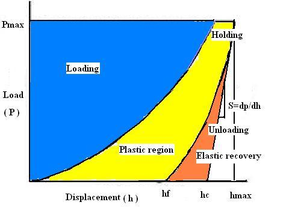

<b>Nanoindentation</b>:-  
Nanoindentation is a standard method to investigate mechanical properties like hardness,elasticity,plasticity index of the material which gives ability to resist permanently,deformed when load is applied.It is mainly concerned with the depth of penetration to nm resolution and the measuring the forces in the uN range in high accuracy and precision. Hardness is proportional to the applied load P divided by the area of contact surface projected in the material. Elastic deformation occurs due to the stretching of the bonds between the atoms when load is applied and when load is removed,it comes back to the original shape.Plastic deformation occurs when load is applied beyond the elastic limit and permanent deformation will takes place. Tensile testing are normally used for bulk samples but nanoindentation can even measure thin film coatings, polymeric materials and soft tissues etc.  

 
<video width="500" height="240" controls>
  <source src="images/nfm.mp4" type="video/mp4">
  Your browser does not support the video tag</video>
 
  

<a href="https://youtu.be/-8HISU35vhY" target=_blank>NPTEL Lecture Link</a>  
<b>How to perform Nanoindentation?</b>  
Nanoindentation is a powerful technique where the indenter tip of known geometry is projected into the specific site in the material to be tested, increasing load is applied and when it reaches the designated maximum value, partial unloading is performed until desired depth is attained. The holding segment is introduced which allows the material to relax before unloading. The process is repeated many times and position of the indenter tip and the surface is monitored with differential transformer.  
Reduced elastic modulus represents the elastic deformation that occurs in both sample and indenter tip.Reduced modulus can be calculated by:  
H=Pmax/(Acontact)  
  
Where,  
E* = Reduced Modulus 
E= Modulus of the specimen 
E'=Modulus of the indenter 
V= Poisson's ratio of the specimen 
V'= Poisson's ratio of the indenter 
For each loading and partial unloading cycle, the curve is plotted between load with depth which provides information about hardness, elastic modulus and plasticity of the material under examination.  
<b>Results</b>  
 
 
 
<b>Conclusion</b>  

Inference  

